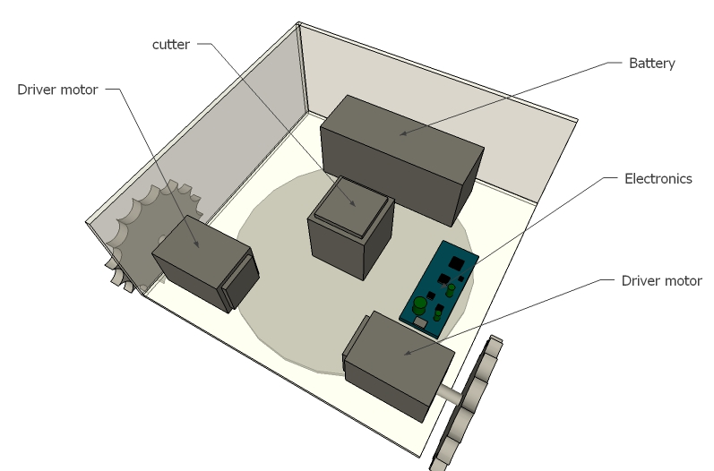
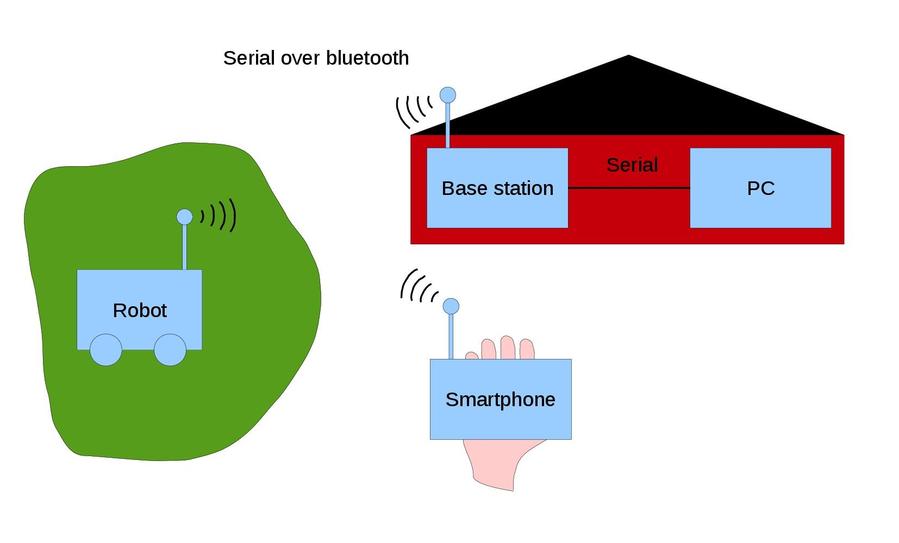
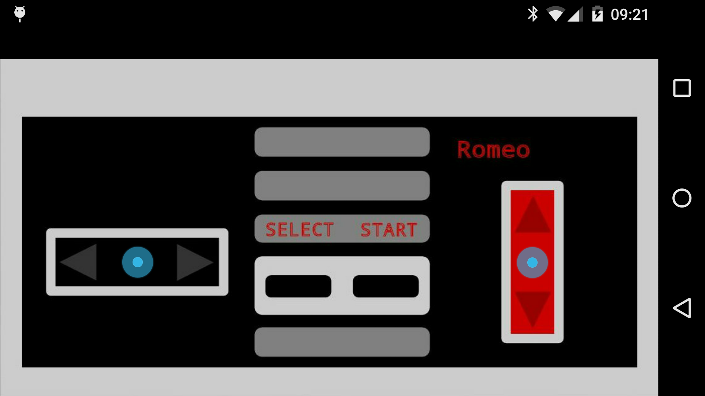
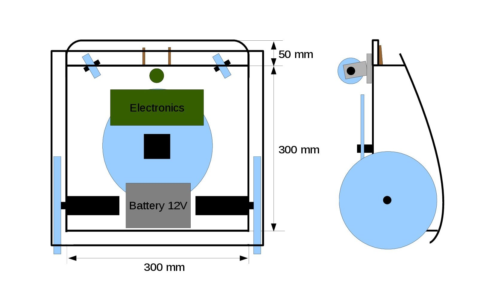
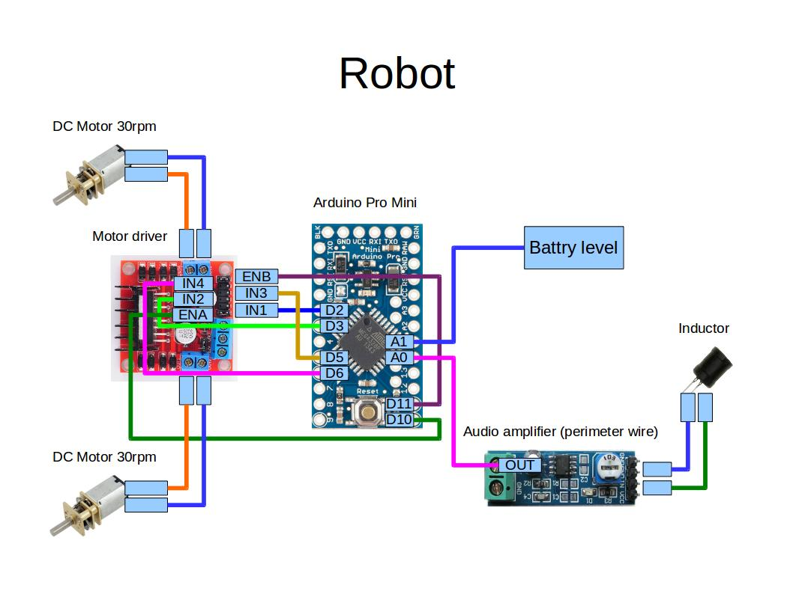
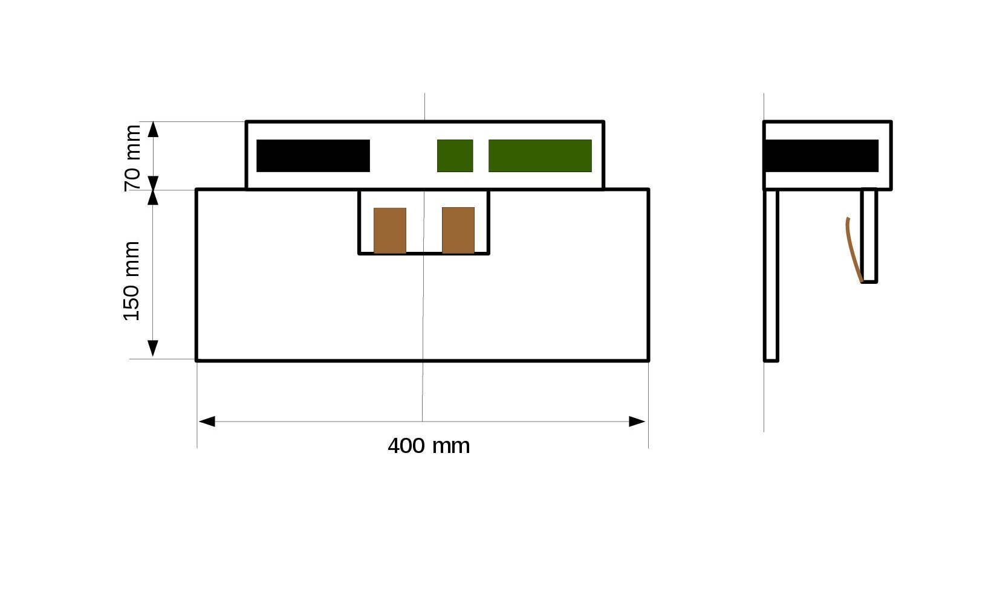
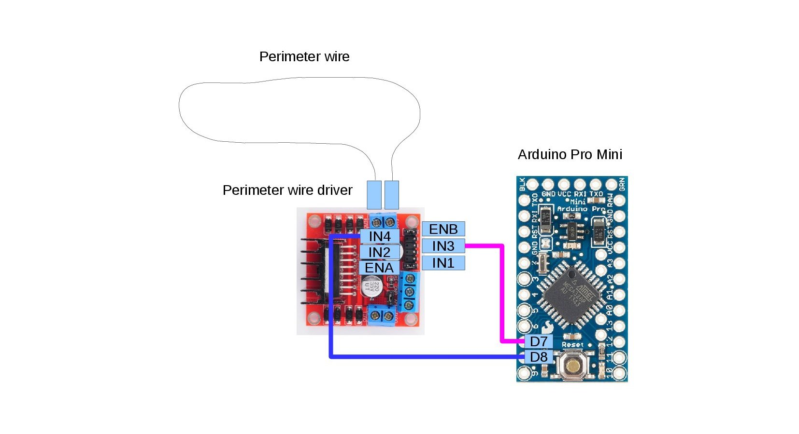
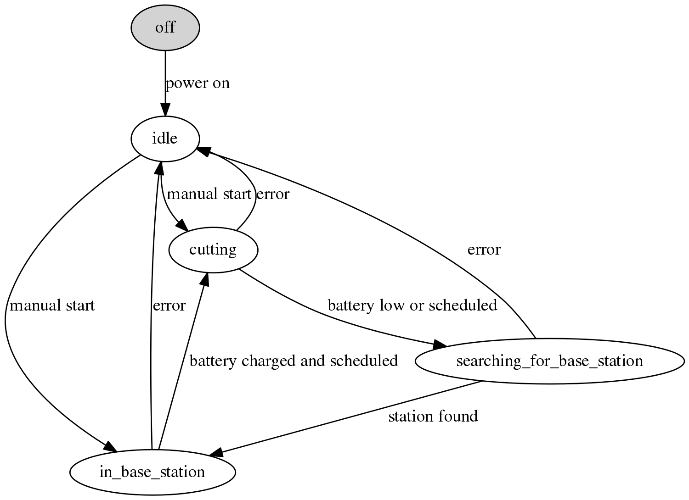
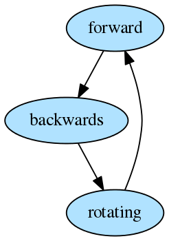
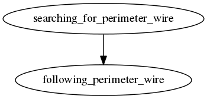

OVERVIEW
========

Romeo (RObot MOwEr) is a lawn mower DIY project, inspired by
Ardumower. It uses the Simba microkernel and build system instead of
the Arduino IDE and libraries.

The goal of the project is to create a simple lawn mower for my tiny
garden of 10 m2, but it will not be limited to that size.

CONNECTIVITY
============

Control and monitor the Robot and the Base station from a device of
your choice, normally a PC. There is also a smartphone application to
manually control the robot.

CONTROLLER ANDROID APP
-------------------------
The controller Android application can set the speed and angular
velocity of the robot. The application connects to the robot using the
same bluetooth interface as the base station, that means only one of the two
can be connected at a time.

HARDWARE
========

ROBOT
-----

### MECHANICAL DRAWING

A drawing of the planned mechanical design of the robot.

### ELECTRONICS SCHEMATIC

VCC and ground are not shown in the schematic.

BASE STATION
------------

### MECHANICAL DRAWING

A drawing of the planned mechanical design of the base station.

### ELECTRONICS SCHEMATIC

VCC and ground are not shown in the schematic.

SOFTWARE
========

The software is written in c and uses the Simba microkernel and build
framework.

Folder structure:

    -- {root}
       +-- app/
       |   +-- base_station/             - base station application
       |   +-- robot/                    - robot application
       +-- doc/                          - documentation
       +-- LICENSE
       +-- Makefile
       +-- README.md
       +-- romeo/                        - romeo package
           +-- src/                      - source code
           +-- tst/                      - test suites
           +-- tools/                    - various tools

ROBOT STATE MACHINE
-------------------
The robot has a two level state machine.

### Top level state machine

#### State descriptions

The grey state is not part of the software state machine. It is
present to give a clear picture of what happens when the power is
turned on.

In the light blue states the robot can drive around in the garden.

In the white states the robot is standing still.

##### idle
The robot is idle, waiting to be started manually.

##### starting
The robot is starting.

##### cutting
The robot is driving around and cuts the grass.

##### searching_for_base_station
The robot is searching for the base station.

##### in_base_station
The robot is in the base station.

### Cutting state machine
This is the state diagram for the cutting state.

#### State descriptions

##### forward
The robot is driving forward.

##### backwards
The robot is driving backwards.

##### rotating
The robot is rotating.

### Searching for base station state machine
This is the state diagram for the searching_for_base_station state.

#### State descriptions

##### searching_for_perimeter_wire
The robot is searching for the perimeter wire.

##### following_perimeter_wire
The robot is following the perimeter wire to the base station.

BILL OF MATERIALS (BOM)
=======================
See [doc/bom.ods](doc/bom.ods).