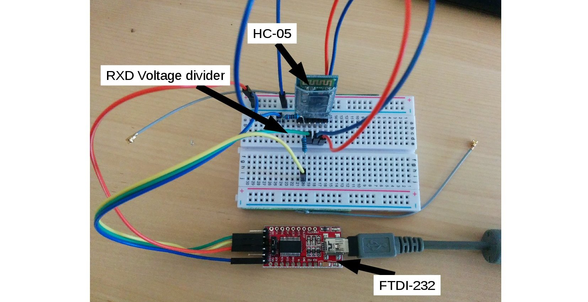
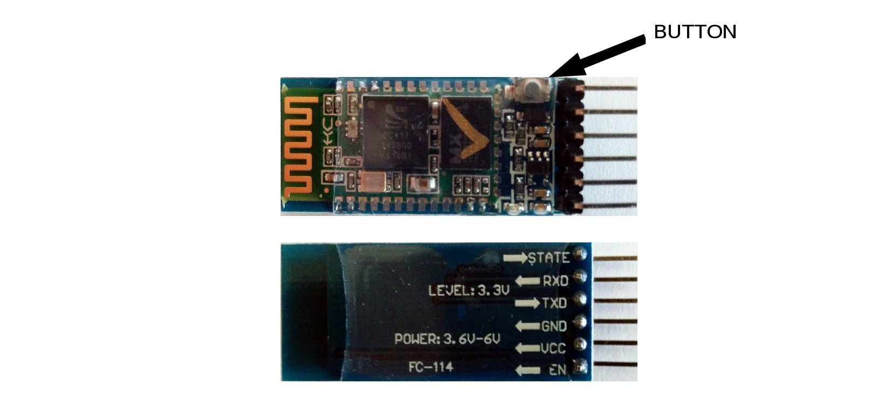

SETUP
-----

FRONT AND BACK
--------------

ENTER "AT MODE"
---------------
1. Connect TXD from the module to the FTDI-232 adapter. RXD is 3.3V logic level. Connect it 
2. Push the button and hold it down.
3. Connect 5V to VCC.
4. Release the button. The LED should flash with a period of roughly 2
   seconds.
5. Setup a serial connection to the module. The baudrate should be
   9600.
6. Type ``AT`` and hit enter. Everything is okay if the module answers
   with ``OK``.

CONFIGURATION
-------------
1. Enter "AT Mode" as described in the previous section.
2. Type ``AT+PSWD=<4 digit password>`` to set the desired password.
3. Type ``AT+PSWD?`` to read the password. Verify that the password in
   step 3 was correctly written.
4. Set baudrate to 38400: ``AT+UART=38400,0,0``
5. Type ``AT+UART?`` to read the UART configuration. Verify that the
   configuration in step 4 was correctly written.
6. Type ``AT+RESET`` to restart the module in normal mode.
