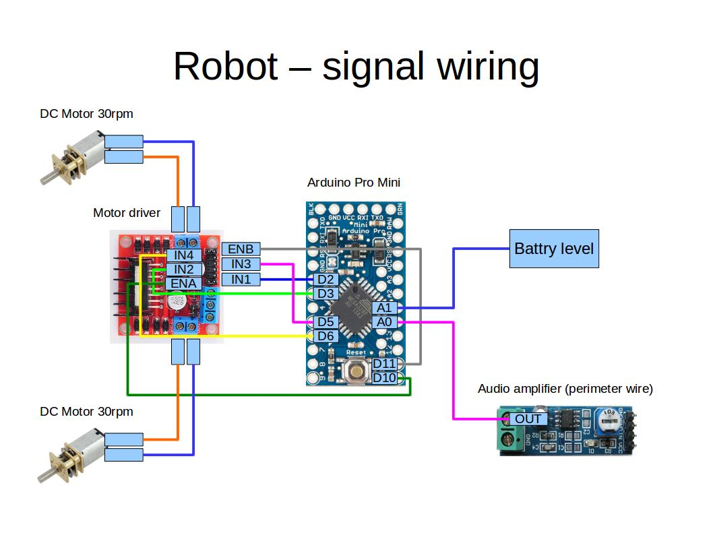

ROBOT
=====

SCHEMATICS
----------

STATE MACHINE
-------------
The robot has a two level state machine.

### Top level state machine

#### State descriptions

##### idle
The robot is idle, waiting to be started manually.

##### starting
The robot is starting.

##### cutting
The robot is driving around and cuts the grass.

##### searching_for_base_station
The robot is searching for the base station.

##### in_base_station
The robot is in the base station.

### Cutting state machine
This is the state diagram for the cutting state.

#### State descriptions

##### forward
The robot is driving forward.

##### backwards
The robot is driving backwards.

##### rotating
The robot is rotating.
